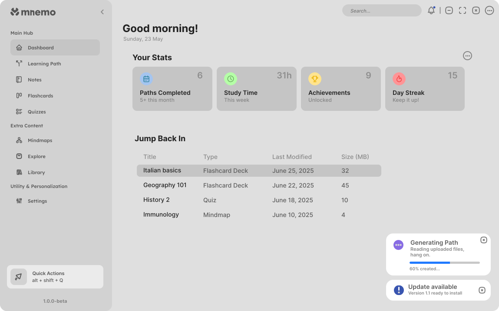
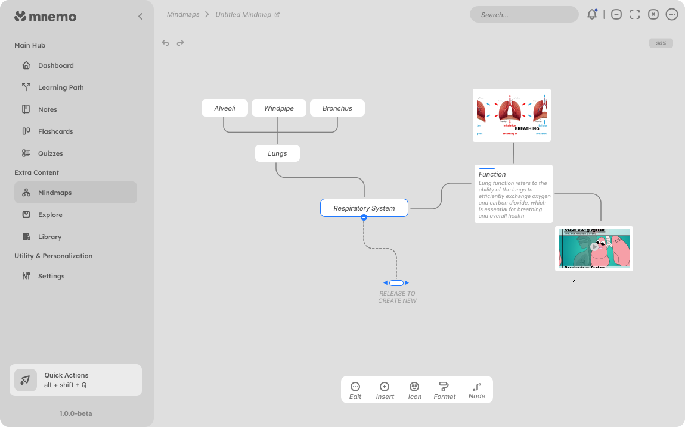
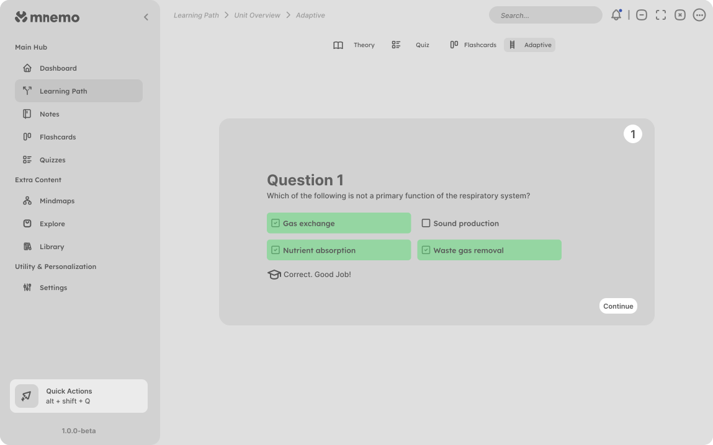
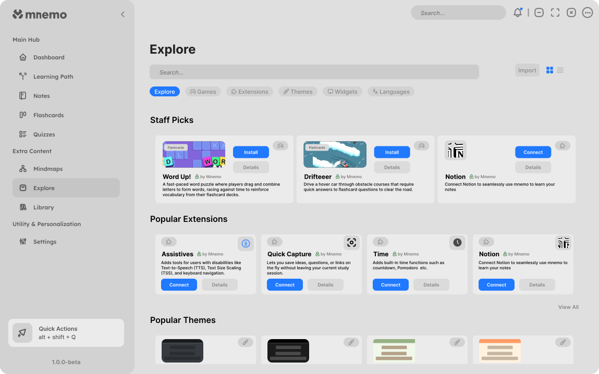
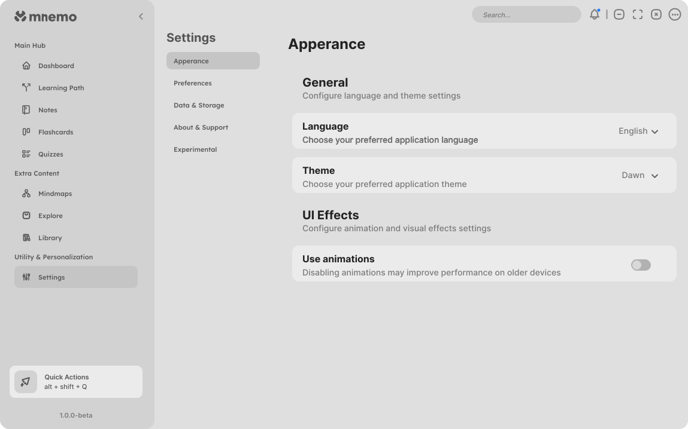

  

  
    
  <strong>A fully offline-capable, privacy-first, extensible learning and content creation platform</strong>

> Free. Open-source. Cross-platform. A next-generation study application built for learners, by learners.
---

## 🚀 What is Mnemo?

Mnemo is a **fully modular**, cross-platform learning platform powered by **Avalonia 11** and **.NET 8**.  
It combines flashcards, notes, mindmaps, learning paths, games, and more, all in one place.  

> No subscriptions. No ads. No tracking. Ever.

We’ve built Mnemo to be:

- **Extensible** – Every feature is an extension (even the core app) thanks to MnemoAPI  
- **Customizable** – Theme & language system with full localization support. Adjust everything from fonts, colors, font size and more.
- **Cross-platform** – Windows, macOS, and Linux  
- **Accessible** – Features designed with inclusivity in mind

---

## 📸 Screenshots

| Dashboard | Mindmap | Learning Path |
|-----------|---------|---------------|
|  |  |  |

| Adaptive Learning Path | Explore | Settings |
|------------------------|---------|----------|
|  |  |  |

---

## 🚀 Features

-  **Flashcards** with spaced repetition algorithms (Anki, Quizlet...)
-  **Text notes** and organization tools
-  **Mindmaps** to visualize concepts
-  **Learning paths** structured ways to learn
-  **Games** powered by the same engine as *Stardew Valley*
-  **Explore** a place to download games, extensions, themes, languages etc.
-  **Progress analytics** track your study progress
-  **Extension development** create fully integrated extensions

---

## 🗺 Roadmap

We release **new features every 1–4 weeks**. Highlights:

### **2025 Q3**
- **Alpha 0.1** – Modular architecture, theme/language switching, learning paths...
- **Alpha 0.2** – Flashcards with multiple algorithms  
- Notes, Games, Explore, Mindmaps

### **2025 Q4**
- **Version 1.0** – Polished cross-platform release

### **Beyond**
- Read Aloud, Audio Review, AI-generated video lessons (done locally)  
- And your suggestions! 💡

📍 See full [Roadmap](https://shadowccs.github.io/mnemo-site/roadmap.html)

---

## 🛠 Tech Stack

- **Avalonia 11** – Cross-platform UI
- **.NET 8**
- **MnemoAPI** – Extension & modular system
- **Custom Component Library**
- **Full theme & language support**

---

## 🤝 Contributing

We’re building Mnemo together. You can:

- [Contribute code](https://shadowccs.github.io/mnemo-site/docs.html#contribution)
- [Join the community on Discord](https://discord.gg/hVjYYru2cb)
- [Suggest features & give feedback](https://shadowccs.github.io/mnemo-site/docs.html#feedback)

---

## 📜 License

Mnemo is **open source** under the MIT license.  
See [LICENSE](LICENSE) for more information.

---

> “Education is not the learning of facts, but the training of the mind to think.”  
> — Albert Einstein
